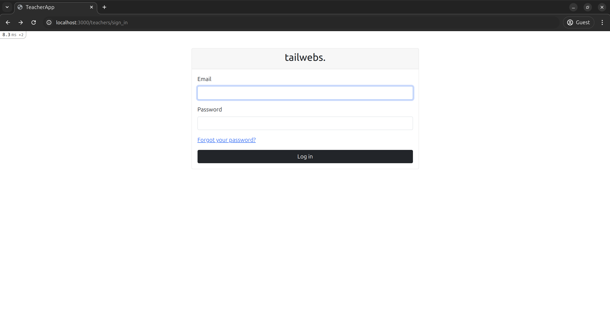
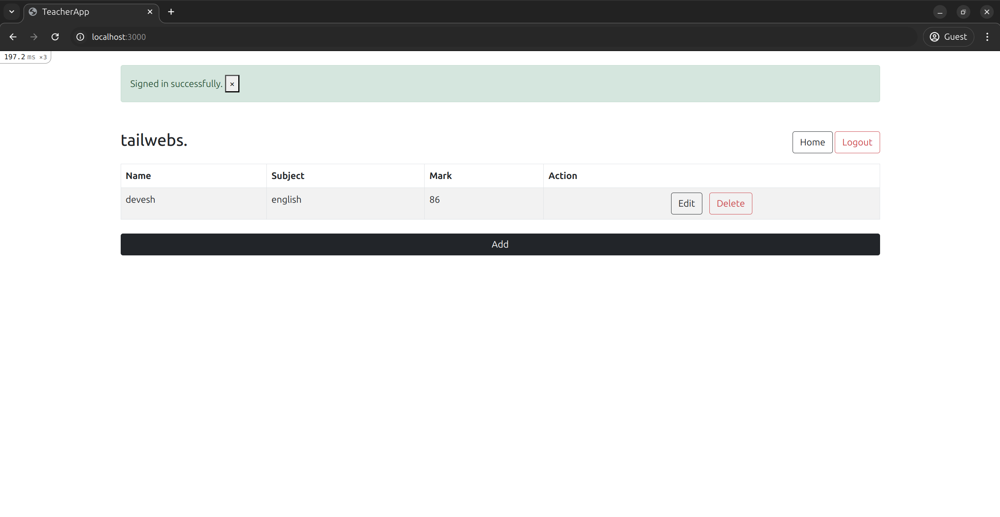
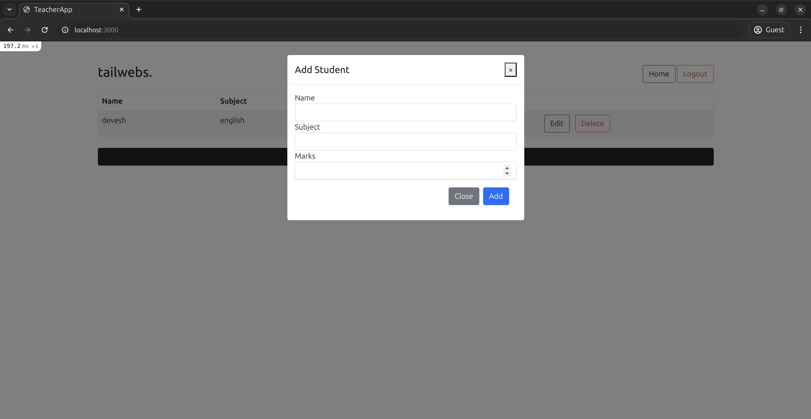

# TeacherApp

TeacherApp is a comprehensive Ruby on Rails application designed for educational institutions to manage student-teacher relationships. The application provides a secure authentication system for teachers and enables them to perform CRUD operations on student records through an intuitive interface.

## Screenshots

### Teachers Login

*Secure teacher authentication interface.*

### Students List

*Interactive student management dashboard with real-time CRUD operations.*

### Student Creation Form

*Responsive form for adding and updating student information.*

## Table of Contents

- [TeacherApp](#teacherapp)
  - [Screenshots](#screenshots)
    - [Teachers Login](#teachers-login)
    - [Students List](#students-list)
    - [Student Creation Form](#student-creation-form)
  - [Table of Contents](#table-of-contents)
  - [Features](#features)
  - [Technologies](#technologies)
    - [Core](#core)
    - [Frontend](#frontend)
    - [Authentication](#authentication)
  - [System Requirements](#system-requirements)
  - [Setup and Installation](#setup-and-installation)
  - [Database Configuration](#database-configuration)
  - [Running the Application](#running-the-application)
  - [Testing](#testing)
  - [Project Structure](#project-structure)
  - [Tips for Development](#tips-for-development)
  - [Production Deployment](#production-deployment)
  - [Contributing](#contributing)
  - [License](#license)
  - [Support](#support)

## Features

- **Authentication System**
  - Secure teacher login using Devise
  - Password recovery and reset functionality
  - Session management

- **Student Management**
  - Create, read, update, and delete student records
  - Associate students with teachers
  - Bulk operations support
  - Form validations

- **User Interface**
  - Responsive design using Bootstrap 5
  - AJAX-powered interactions for seamless updates
  - Interactive data tables
  - Flash notifications for user feedback

- **Security**
  - CSRF protection
  - Secure password handling
  - Authentication required for all actions

## Technologies

### Core
- Ruby 3.2.1
- Rails 6.1.4
- PostgreSQL (Database)

### Frontend
- Bootstrap 5 (UI Framework)
- jQuery (JavaScript Library)
- Webpacker (Asset Pipeline)
- SCSS (Styling)

### Authentication
- Devise (User Authentication)

## System Requirements

- Ruby 3.2.1 or higher
- Rails 6.1.4 or higher
- PostgreSQL 12.0 or higher
- Node.js 14.0 or higher
- Yarn 1.22 or higher
- Modern web browser (Chrome, Firefox, Safari, or Edge)

## Setup and Installation

1. **Clone the repository**
   ```bash
   git clone https://github.com/thedevdevesh/teacher_app.git
   cd teacher_app
   ```

2. **Install Ruby dependencies**
   ```bash
   bundle install
   ```

3. **Install JavaScript dependencies**
   ```bash
   yarn install
   ```

4. **Set up environment variables**
   ```bash
   cp .env.example .env
   # Edit .env with your configuration
   ```

## Database Configuration

1. **Create database and run migrations**
   ```bash
   rails db:create
   rails db:migrate
   ```

2. **Seed the database (optional)**
   ```bash
   rails db:seed
   ```

## Running the Application

1. **Start the Rails server**
   ```bash
   rails server
   ```

2. **Start the Webpack development server**
   ```bash
   bin/webpack-dev-server
   ```

3. Visit `http://localhost:3000` in your browser

## Testing

Run the test suite:
```bash
bundle exec rspec
```

## Project Structure

```
app/
├── controllers/
│   ├── application_controller.rb
│   └── students_controller.rb
├── models/
│   ├── student.rb
│   └── teacher.rb
├── views/
│   └── students/
│       ├── _form.html.erb
│       ├── index.html.erb
│       └── edit.html.erb
├── assets/
│   └── stylesheets/
└── javascript/
    └── packs/

config/
├── routes.rb
└── database.yml

db/
├── migrate/
└── schema.rb
```

## Tips for Development

- Use `rails console` for interactive debugging
- Check `log/development.log` for detailed logs
- Run `rubocop` for code style checking
- Use `rails routes` to view available endpoints

## Production Deployment

1. **Prepare the application**
   ```bash
   RAILS_ENV=production rails assets:precompile
   RAILS_ENV=production rails db:migrate
   ```

2. **Configure production server**
   - Set up Nginx/Apache
   - Configure SSL certificates
   - Set up environment variables

## Contributing

1. Fork the repository
2. Create your feature branch
3. Write tests for new features
4. Ensure tests pass
5. Submit a pull request

## License

This project is licensed under the MIT License - see the LICENSE.md file for details.

## Support

For support, please open an issue in the GitHub repository or contact the development team.
